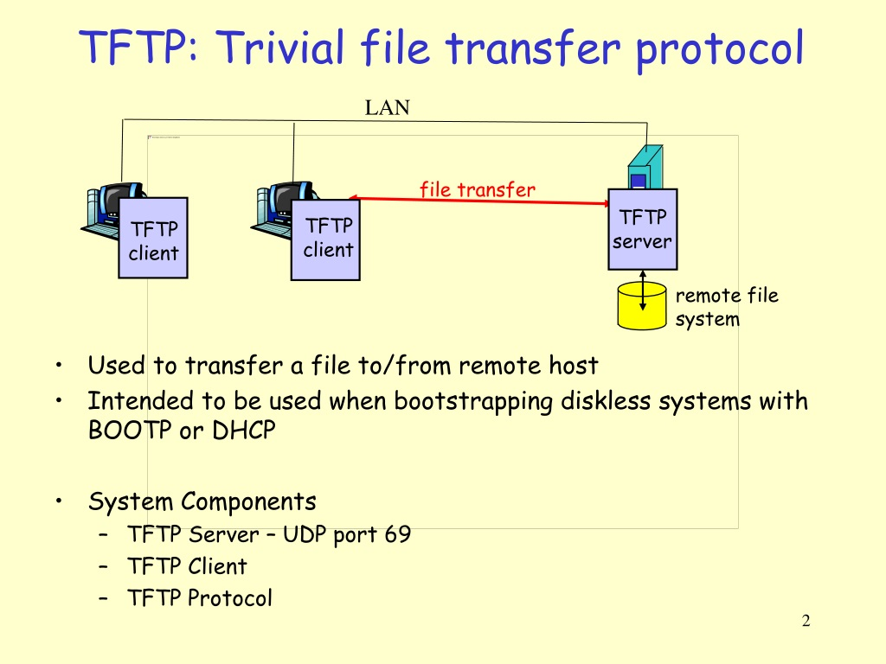

# TFTP_Client_Server
A simple TFTP client-server implementation in C for transferring files using UDP, featuring a server-side GUI for real-time progress monitoring.

This project implements a Trivial File Transfer Protocol (TFTP) client-server system in C, utilizing UDP for file transfer. The server supports WRQ (Write Request) operations and includes a GTK+ GUI for real-time file transfer progress visualization. The client sends files to the server in 512-byte blocks with acknowledgment (ACK) handling, ensuring reliable communication. The system adheres to the TFTP protocol (RFC 1350) and can be extended to support larger block sizes (RFC 2348).

